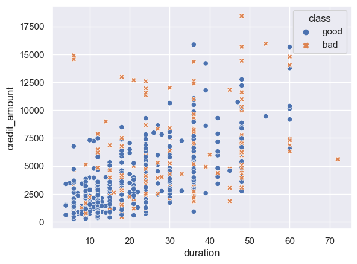

# Credit risk predictive modelling and risk optimisation

A hypothetical bank has to determine the risk of issuing credit to clients by modelling the probability of loan default and creating a risk model. It then has to optimise profit earned for a certain risk level which varies from quarter to quarter.

# **Notebooks**

### Part 1 - EDA
- Analysing relationship between categorical vars and target
- Deciding which categorical variables to convert to numerical, one-hot-encode, embed, and target encoding

### Part 2 - Preprocessing categorical data
- Feature selection with chi2 test for considerations of curse of dimensionality
- One hot encoding
- Encoding categories into target means
- Tokenising text data and converting into vectors and into columns

### Part 3 - Preprocessing numerical data
- Creating selected categorical features into numerical data
- Creating features based on discovered patterns and heuristics

### Part 4 - Feature selection, scaling, oversampling, model selection
- Train test split
- Creating data: unscaled, standardised, normalised 
- Oversampling of minority class
- Cross validated grid search on: 3 types of scaled and unscaled data, optimal features, grid scoring function
- Evaluation of performance metrics: Acc, Recall, Area under ROC
- Models tested: Logistic Reg, Random For, SGD, Gradient Boost, Adaboost(decision Tree), Adaboost(Log Reg), Gaussian process, SVM, XGBoost

### Part 5 - Performance tuning of best models (Adaboost and Logreg)
- Preparation of data (train data in split had to be increased slightly because of underfitting)
- Determining optimal number of features to use with analysis of AUC and number of features
- Tuning parameters with best selected data/model/grid scoring function
- Tuning positive threshold for higher accuracy
- Confusion matrix and ROC curves
- Saving of predicted probability results on test data for next part

### Part 6 - Optimisation of risk budget
- Calculation of interest rate and interest to be paid
- Calculation of risk factor with Probability of default and credit amount based on risk model
- Determining maximum POD threshold to offer credit based on ideal POD threshold for positive class (det. in part V)
- Optimising for max profit as given risk budget by determining which clients to offer/reject with Mixed-integer linear programming
- Visualising POD and interest rates/amounts of approved credit to understand risk portfolio (presentation to management)
- Conclusion

# **Business objective**

### Project objective
The purpose of this predictive modelling project is simply not to predict if a client will default on their loan by determining their credit class (good or bad).

Rather, the purpose of this project is to maximize profits for a hypothetical bank gained through interest from clients who take a loan and succesfully repay them. This hypothetical bank has to minimise the amount of risk accrued from lending money while maximising potential profit.

### Variables for prediction
The variables of interest are **credit_amount, duration, and class(good or bad)**. By creating a data driven model that can predict the probability of a client successfully repaying a loan, we can selectively create the best balance of profit to risk so as to maximise profit to the business while mitigating capital loss risk.

Clients who have a higher probability of defaulting will have to pay higher interest rates, these clients represent greater sources of value to the business, capped at a specific Probabilty of default level determined by the model, where the probability of default on a loan is too risky to give credit.

### Interest rate charges
To simulate realistic bank charges, credit interest rates are a function of credit amount, duration, and probability of default (POD) and duration rise. The interest exponentially increases as default risk (POD) rises **which is in line with real banking practices**.
The interest charges will be:
* Base of 2% for duration up to 10 time units, and an additional 0.5% for every additional part of 10 time units
* 0% additional interest for POD values up to 10%, additional $ e^((POD-0.1)*5) $ for POD values above 10%

A loan of 20,000 for 11 time units at 0.2 POD has to pay: $ (2+0.5)+[e^(0.2-0.1)*5]=4.15 $ %

### Risk model and model performance evaluation
Using my knowledge of financial risk modelling from my experience as a DS in fintech and the methodologies described in this article https://www.listendata.com/2019/08/credit-risk-modelling.html. A model will be created to predict POD with machine learning or statistical techniques, and the model will be evaluated with the following techniques:
* Area under ROC curve
* Precision recall curve
* Confusion Matrix

### Risk and profit calculation
Risk is a function of amount of capital the bank risks losing and the probability of default. A client with 0% POD represents no risk, and any interest gained from this loan is, riskless (free) profit.
**Risk factor = (probability of default ^ 1.5) * amount of credit**

Profit calculation = capital gained from interest

Based on these formulas for risk factor calculation, the risk accrued by the bank in the following two scenario for credit given by the theoretical bank are not identical:

* 2 loans for 10,000 with a POD of 0.1 at 10 time units. 
* Risk = 2 x (0.1)^1.5 *10000 = 623.45
* 1 loan for 10,000 with a POD of 0.2 at 10 time units. 
* Interest = (0.2)^1.5 *10000 = 894.43

Based on this model there is less risk to the bank accrued by issuing two 0.1 POD loans compared a single 0.2 POD loan even though the amount of money lended as credit is the same. This makes sense from a practical perspective, it is safer to issue two low risk loans than a single high risk loan.

### Why make this problem so difficult? and optimisation
Because of the unique structure of the interest rate charges, there is additional benefit to issuing higher risk loans to complicate the problem of maximising interest further. Without the additional interest rate charges for higher POD, this data science project becomes less based in reality (a bad thing), and this is an opportunity to create more advanced solutions to realistic banking problems.

After modelling the POD, I can calculate the interest gained on each loan of the training dataset and optimise the maximum amount of interest earned to the bank for the minimum risk factor with optimisation techniques.

